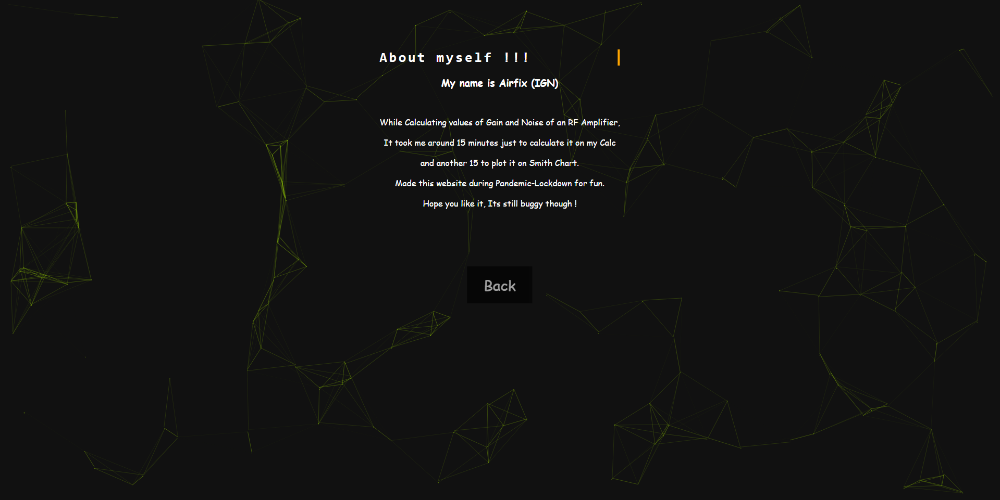

# RF_gain_noise_calculator-
This is a small website which calculates stuff like Gain and Noise for RF amplifier design

The main page preview below has a particle js effect and has options to select

To calculate SHA-2 code enter text and voila

To calculate the gain enter the values

The result

For Noise Cirlces

Noise result 

About 

